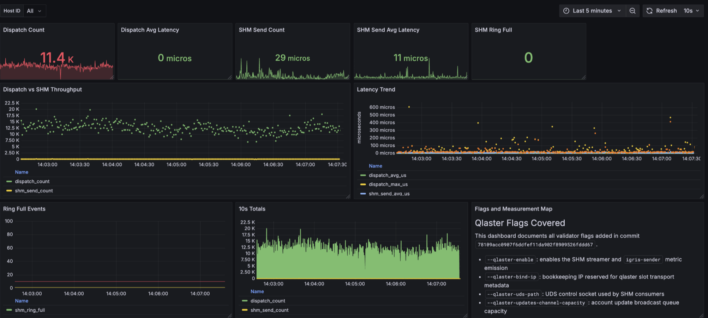

# Qlaster

Shared-memory data streaming for colocated Solana services.

Account, transaction, and slot updates are fanned out from a single sender to local
consumers over a per-consumer SPSC ring in `/dev/shm`, with a Unix-domain
control socket for handshake, subscription, and eventfd-based wakeups.



## Why

- **Zero-copy hot path.** Updates land in mmap'd ring memory; consumers read in
  place. No socket copy, no serializer per consumer.
- **Filter at the sender.** Per-consumer subscriptions (account pubkeys,
  owners, transaction opt-in) — large filters fall back to a bloom-pre-reject.
- **Backpressure-aware.** A slow consumer that fills its ring is dropped
  rather than stalling the dispatcher.
- **Opportunistic LZ4** on account payloads ≥ 500 KiB when entropy sampling
  predicts a real win.

## Layout

- `sender/` — binds the UDS, provisions a ring + eventfd per consumer, runs
  the dispatcher tasks fed by `broadcast::Sender<AccountUpdate>` /
  `broadcast::Sender<TransactionUpdate>` / `broadcast::Sender<SlotUpdate>`.
- `consumer/` — connects to the UDS, receives the ring path + eventfd via
  `SCM_RIGHTS`, drains frames into `crossbeam_queue::ArrayQueue`s the caller
  polls.
- `shm/` — ring buffer, eventfd, UDS framing primitives.
- `types.rs`, `wire.rs` — wire format and frame codecs.

## Usage

```rust
use qlaster::sender::{SenderConfig, ShmTransportConfig, setup_sender};
use qlaster::consumer::setup_shm_consumer;
use qlaster::metrics::QlasterSenderMetrics;
use std::sync::Arc;
use tokio::sync::broadcast;

let (updates_tx, _) = broadcast::channel(128);
let cfg = SenderConfig { shm: ShmTransportConfig::defaults("/tmp/qlaster.sock") };
let sender = setup_sender(cfg, updates_tx.clone(), None, Arc::new(QlasterSenderMetrics::new())).await?;
tokio::spawn(sender.run());

let mut consumer = setup_shm_consumer("/tmp/qlaster.sock").await?;
consumer.subscribe(vec![pubkey], vec![]).await?;
while let Some(update) = consumer.updates.pop() { /* ... */ }
```

See `tests/shm_flow.rs` for end-to-end examples (account filtering, transaction
opt-in, always-on slot updates, reconnection).

## Requirements

Unix. Linux is the production target; macOS is supported for development.

- **Inter-process wakeups** use `eventfd(2)` on Linux and a self-pipe on macOS
  (the sender holds the write end and hands the consumer the read end). Both
  are passed over `SCM_RIGHTS`.
- **The shared-memory ring** is a regular `mmap(MAP_SHARED)` file — there is no
  `memfd_create` dependency. On Linux the default directory is the RAM-backed
  `/dev/shm`; on macOS it falls back to the platform temp dir
  (`std::env::temp_dir()`), which is APFS-backed, so ring latency on macOS is
  not representative of production.
- **SIGPIPE** is suppressed per-send via `MSG_NOSIGNAL` on Linux and via the
  `SO_NOSIGPIPE` socket option on macOS.

Sender and consumer must run on the same host and share the shared-memory
directory the sender chooses.

Build: edition 2024 (Rust 1.85+).
